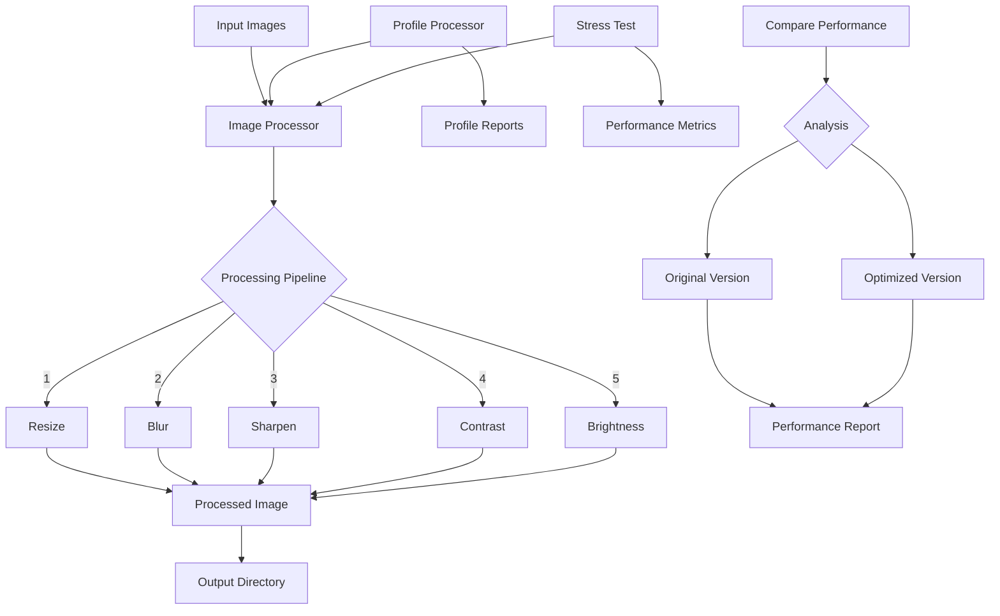

# Image Processing Performance Optimization Demo

This project demonstrates how to identify and optimize performance bottlenecks in a Python image processing application using profiling tools and Amazon Q Developer.

## Repository Structure

```
image-processor/
├── src/                   # Source code directory
│   ├── __init__.py
│   ├── image_processor.py # Core image processing implementation
│   └── utils/            # Utility functions
│       ├── __init__.py
│       └── file_utils.py
├── scripts/              # Helper scripts
│   ├── download_sample_images.py
│   ├── run_processor.py
│   └── stress_test.py
├── tests/               # Test files
│   ├── __init__.py
│   └── test_image_processor.py
├── profiling/          # Profiling tools and reports
│   ├── profile_processor.py
│   ├── profile_stress_test.py
│   ├── run_profiling_with_visualization.py
│   ├── visualize_profile.py
│   └── reports/        # Profiling output files
│       ├── profile_stats.prof
│       ├── stress_test_profile.prof
│       ├── callgrind.out
│       └── profile_visualization.{dot,png}
├── data/               # Data directories
│   ├── images/        # Input images
│   └── output/        # Processed images
├── docs/              # Documentation
│   ├── profiling_analysis.md
│   ├── kcachegrind_usage_guide.md
│   └── project_details.md
├── image_processor.py      # Original implementation
├── optimized_image_processor.py  # Optimized version
├── compare_performance.py  # Performance comparison tool
├── run_optimized.py       # Script to run optimized version
├── devfile.yaml           # Development environment config
├── requirements.txt       # Python dependencies
├── setup.py              # Package setup file
└── README.md             # This file
```

## Data Flow



## Setup

1. Install the required dependencies:

```bash
pip install -r requirements.txt
```

2. Download sample images using the provided script:

```bash
python download_sample_images.py --count 10
```

## Running the Application

To process images with the inefficient implementation:

```bash
python image_processor.py --input ./images --output ./output
```

## Profiling the Application

To profile the application's performance:

```bash
# Run all profiling types (CPU, memory, time)
python profile_processor.py --input ./images --output ./output

# Run specific profiling type
python profile_processor.py --input ./images --output ./output --profile-type cpu
python profile_processor.py --input ./images --output ./output --profile-type memory
python profile_processor.py --input ./images --output ./output --profile-type time
```

## Stress Testing

For more intensive performance analysis, use the stress test scripts:

### Running the Stress Test

The stress test applies more intensive processing with multiple iterations of each operation:

```bash
# Run with default settings (20 images, 3 iterations per operation)
python stress_test.py

# Customize the stress test
python stress_test.py --iterations 5 --blur-radius 8 --image-count 30
```

Key parameters:
- `--iterations`: Number of times to repeat each operation (default: 3)
- `--blur-radius`: Maximum blur radius to use (default: 5)
- `--image-count`: Target number of images to process (default: 20)

The stress test will automatically duplicate existing images if needed to reach the target count.

### Profiling the Stress Test

```bash
# Run all profiling types on the stress test
python profile_stress_test.py

# Run specific profiling with custom settings
python profile_stress_test.py --profile-type cpu --iterations 4 --image-count 25
```

The stress test profiling results will be saved to `./profiles/stress_profile_stats.prof`.

## Profiling Results

The profiling results are analyzed in detail in the [profiling_analysis.md](./profiling_analysis.md) file. Key findings include:

- Gaussian blur is the most time-consuming operation
- Unnecessary image copies create significant overhead
- Sequential processing doesn't utilize multi-core processors
- Inefficient file listing adds unnecessary overhead

## Visualizing Profile Data

### Using KCachegrind (Recommended)

KCachegrind provides the most comprehensive and detailed visualization of profiling data:

```bash
# Run profiling and automatically open KCachegrind
python run_profiling_with_visualization.py

# Run stress test profiling and open KCachegrind
python run_profiling_with_visualization.py --stress-test

# Run specific profiling type
python run_profiling_with_visualization.py --profile-type cpu
```

You can also convert existing profile data to KCachegrind format:

```bash
# Convert and open existing profile data
python visualize_profile.py ./profiles/profile_stats.prof

# Convert without opening KCachegrind
python visualize_profile.py ./profiles/profile_stats.prof --no-open
```

### Using SnakeViz (Alternative)

You can also visualize the CPU profile data using snakeviz:

```bash
# For regular profiling
snakeviz ./profiles/profile_stats.prof

# For stress test profiling
snakeviz ./profiles/stress_profile_stats.prof
```

## Performance Issues Identified

The application has several performance issues:

1. Inefficient file listing and filtering
2. Unnecessary image copies (25 calls to Image.copy())
3. Sequential processing (no parallelism)
4. Inefficient image loading and saving
5. Suboptimal algorithm choices (e.g., Image.NEAREST for resizing)
6. Redundant image conversions

## Optimization Opportunities

Based on the profiling results, these are the key optimization opportunities:

1. Implement parallel processing with multiprocessing or concurrent.futures
2. Reduce unnecessary image copies
3. Use more efficient algorithms and PIL options
4. Optimize file listing with a single pass approach
5. Add proper error handling
6. Adjust quality settings for better performance

## Recent Changes

- Added stress test scripts for more intensive performance analysis:
  - `stress_test.py`: Extended version with more intensive processing
  - `profile_stress_test.py`: Script to profile the stress test
- Fixed the download_sample_images.py script:
  - Changed `-h` flag to `--ht` to avoid conflict with built-in help
  - Switched image source from Unsplash to Lorem Picsum for more reliable downloads
- Added profiling_analysis.md with detailed performance analysis
- Updated README.md with more comprehensive information